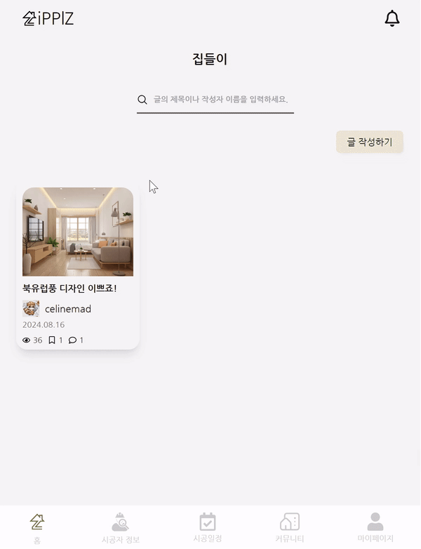

    <h1>ZiPPlZ</h1>
<!--     <h2>🎉 기획 의도</h2>
    

        <ul>
        디자인 감각이나 시공 스킬이 부족할 경우 결과물이 실망스러울 가능성이 높은 <i>셀프 인테리어</i>, 총 시공비용의 15~20%가 수수료로 업체에 돌아가는 <i>턴키 인테리어</i></li>
         
        <li>
          그리고
          인테리어에 관심있는 신혼부부들 사이에서 인기를 끄는 <strong>반셀프 인테리어!</strong>
          하지만 반셀프 인테리어 또한, 시공자와 고객이 연결될 수 있는 플랫폼이 부족하고, 수많은 계약들과 시공일정들을 정리하기가 복잡하기 때문에 반셀프 인테리어를 하는 분들을 위해 기획하게 되었습니다.
          </li>
      </ul>
    
 -->
    <h2>🏡 서비스 소개</h2>
    

        
반셀프 인테리어 스케줄링 및 시공자와 고객을 이어주는 플랫폼 서비스입니다.

    

     
    <h2>🗓️ 프로젝트 기간</h2>
    
2024.07.02 ~ 2024.08.16

     
    <h2>🛠️ 기술 스택</h2>
    <ul style="list-style: square;">
        <li><h3>Client</h3> 
        
        
      
        
        
        </li>
       <li><h3>Server</h3>
        
        
        
        
        
        
       </li>
        <li><h3>Real-time Communication</h3>
          
          
          
          
          
          
        </li>
        <li><h3>AI Ops / DevOps</h3>
                
                
                
              
                
                
        </li>
        <li><h3>Communication</h3>
              
              
              
              
        </li>
    </ul>
     
    <h2>👨‍👩‍👦‍👦 팀원</h2>
    <ul>
    <li><a  target="_blank" href="https://github.com/Celinemad">이가은 (팀장, Backend)</a></li>
    <li><a  target="_blank" href="https://github.com/Kang-singu">강신구 (Backend)</a></li>
    <li><a  target="_blank" href="https://github.com/RatlyREM">이주호 (Backend)</a></li>
    <li><a  target="_blank" href="https://github.com/hannabananah">강한나 (Frontend)</a></li>
    <li><a  target="_blank" href="https://github.com/KIMHT98">김현태 (Frontend)</a></li>
    <li><a  target="_blank" href="#">백승범 (Frontend)</a></li>
    </ul>
     
    <h2>✨ 주요 기능</h2>
    <h3> 🟠 스케줄링</h3>
  

  

    
 1. 스케줄 등록

    
  
 
  

    
2. 스케줄러 공유이미지 등록

    
  
 
  

    
 3. 스케줄러 공유메모 수정

    
  
 
  

    
 4. 스케줄러 계약서 이동 & 계약서 수정

    
  
 
  

    
 5. 스케줄러 채팅방 이동

    
  
 
  

    
 6. 스케줄러 개인시공 등록

    
  

       
      
✔️ 고객과 시공자가 서로 공유할 문서와 메모 업로드
 
      
✔️ 스케쥴링 캘린더에서 시공 일정을 확인 가능

      
✔️ 시공자 정보, 시공 일정, 시공 가격, 메모 확인 및 계약서 조회, 시공자 문의 기능

      
✔️ 개인이 원하는 일정도 커스텀으로 등록 가능

     
    <h3> 🟠 가상 이미지 변환</h3>
    

      

    
 1. 이미지 선택

    
      
 
      

      
 2. 이미지 변환

      
      
 
    

       
      
✔️ Segment Anything Model을 활용한 가상 이미지 변환

      
✔️ Embedding 방식을 활용하여 Segment 진행

      
✔️ ONNX Library를 사용하여 구역 선택 후 바꾸고 싶은 자재 선택

      
✔️ Karlo API를 활용하여 이미지 편집 진행

       
<h3> 🟠 화상채팅</h3>

고객

 

시공자
 

 

✔️ WebRTC를 사용하여 1대1 화상채팅

✔️ 화상채팅 중 시공자와 고객간 실시간 계약서 화면공유

✔️ 계약서 작성 즉시 양측에 전달되는 계약서 내용

✔️ 계약서 수락, 거절을 눌러 즉시 전달되는 계약과정

 
  <h3> 🟠 시공자 리스트</h3>
    

    

    
    

    

    

  

   
  
✔️ 생성형 AI를 활용한 긍정/부정적 후기 요약

  
✔️ 고객이 시공자의 정보와 작업 이미지 열람

  
✔️ 시공자의 일정을 고려하여 문의 가능

   

  <h3> 🟠 커뮤니티</h3>
    

    

  
 집 자랑글 커뮤니티

  
    

  

     
    
✔️ 모든 유저들이 업로드한 집 자랑글 열람

    
✔️ 제목과 내용을 작성 한 뒤, 내 pc에 저장된 인테리어 사진과 시공에 함께 참여한 시공업자 리스트를 추가하여 업로드

   
  <h2>🗃️ 아키텍처</h2>
      
   

